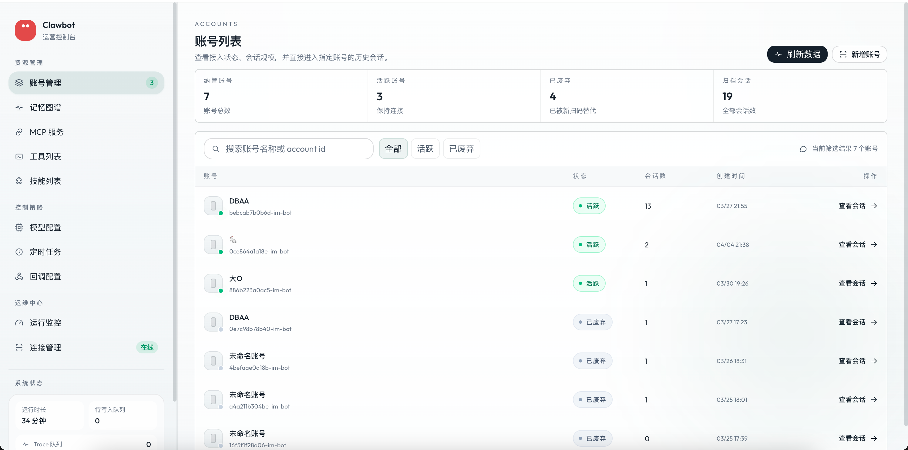
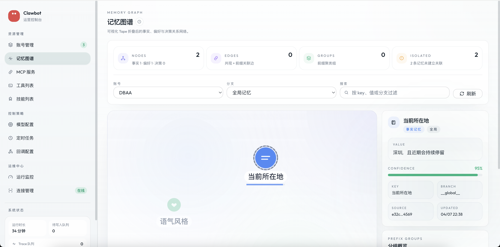
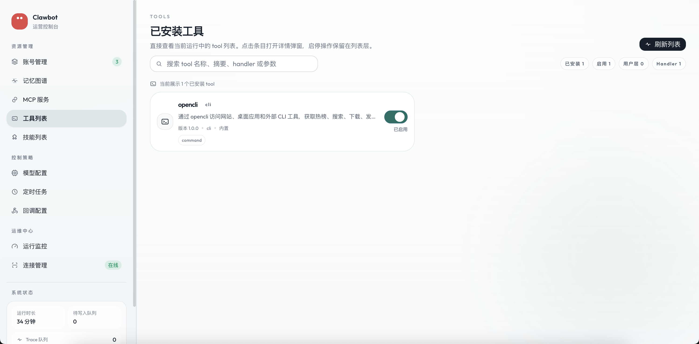
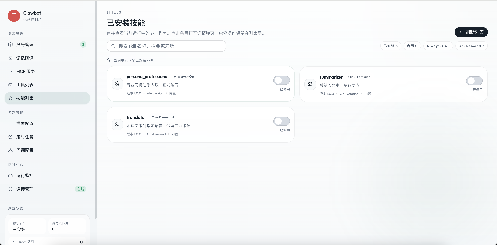
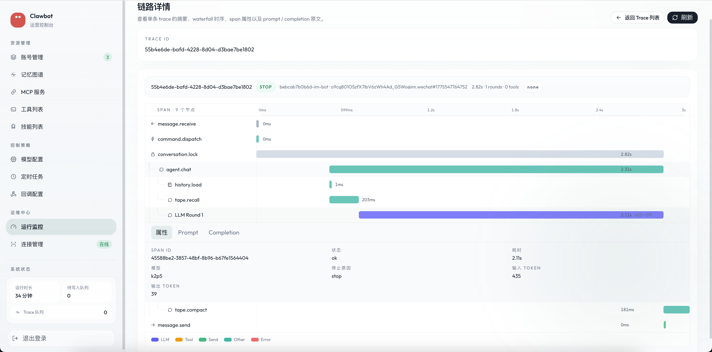
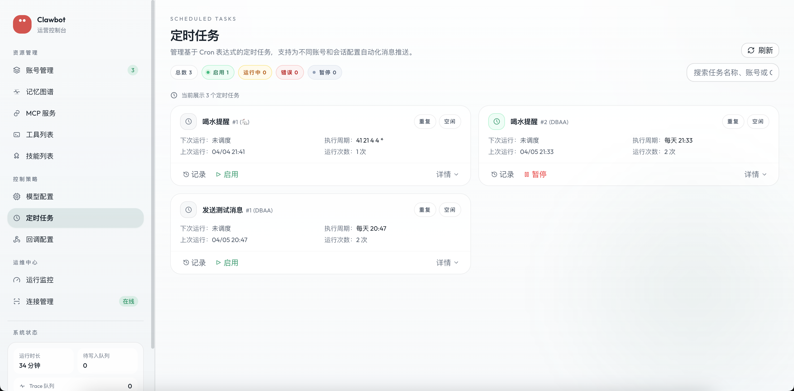
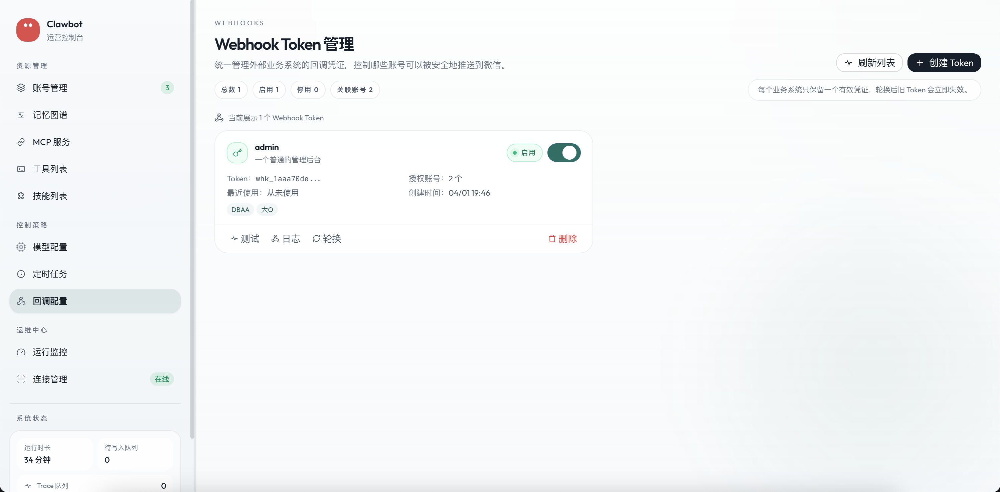
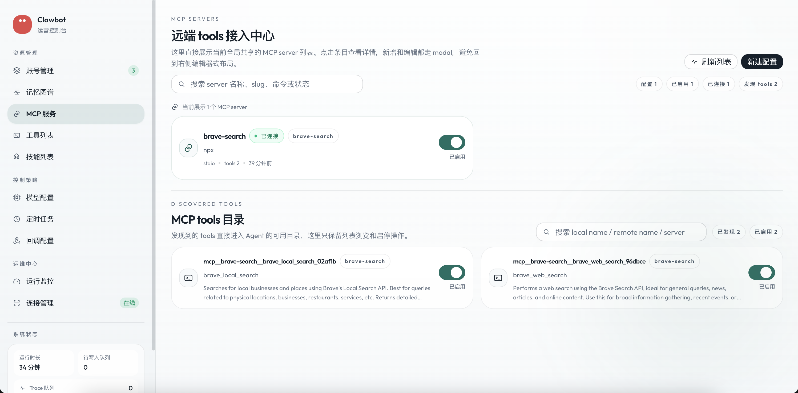

<div align="center">
  <h1>微信 ClawBot Agent</h1>
  <p>多账号微信 AI Agent 管理平台。</p>
  <div align="center">
    
    
    
    
  </div>
</div>

微信 ClawBot Agent 用来把多个微信号接入为独立 AI Agent，并通过 Web 后台统一管理。当前推荐的生产部署方式是 Docker Compose。

## 为什么用它

- 多账号统一管理：一个后台查看、接入和运营多个微信 AI 账号
- 管理能力完整：账号、记忆、工具、技能、RSS 订阅、任务中心、Prompt 任务、Webhook、MCP 都有可视化入口
- 部署路径直接：基于 Docker Compose 启动，适合作为开源项目快速体验和落地
- 扩展方式清晰：支持工具、技能、Webhook 和 MCP Server 组合扩展

## 界面预览

<table>
  <tr>
    <td></td>
    <td></td>
  </tr>
  <tr>
    <td align="center"><strong>账号管理</strong></td>
    <td align="center"><strong>记忆图谱</strong></td>
  </tr>
  <tr>
    <td></td>
    <td></td>
  </tr>
  <tr>
    <td align="center"><strong>工具列表</strong></td>
    <td align="center"><strong>技能列表</strong></td>
  </tr>
  <tr>
    <td></td>
    <td></td>
  </tr>
  <tr>
    <td align="center"><strong>运行监控 Trace</strong></td>
    <td align="center"><strong>定时任务</strong></td>
  </tr>
  <tr>
    <td></td>
    <td></td>
  </tr>
  <tr>
    <td align="center"><strong>Webhook</strong></td>
    <td align="center"><strong>MCP 服务</strong></td>
  </tr>
</table>

## 快速部署

```bash
git clone https://github.com/DBAAZzz/easy-weixin-clawbot.git
cd easy-weixin-clawbot

cp .env.example .env
# 编辑根目录 .env
docker compose up --build -d
```

启动前至少需要补这几项配置：

- `.env`：`POSTGRES_PASSWORD`
- `.env`：`CLAWBOT_CREDENTIAL_KEY`
- `.env`：`AUTH_USERNAME`、`AUTH_PASSWORD`、`AUTH_JWT_SECRET`

LLM Provider 不再通过 `.env` 配置。服务启动后，请登录 Web 管理后台，在“模型配置”页面创建 Provider 模板并添加使用配置。

生成 `CLAWBOT_CREDENTIAL_KEY`：

```bash
node -e "console.log(require('crypto').randomBytes(32).toString('hex'))"
```

默认访问地址：

- Web 管理后台：[http://localhost](http://localhost)
- API 健康检查：[http://localhost:8028/api/health](http://localhost:8028/api/health)

常用命令：

```bash
docker compose logs -f server
docker compose ps
docker compose down
```

更完整的部署说明见 [docs/readme/docker-deployment.md](./docs/readme/docker-deployment.md)。

## 配置约定

项目现在只保留一个配置入口：仓库根目录 `.env`。

- 只保留一个示例文件：`.env.example`
- `packages/server` 不再使用 `packages/server/.env`
- 后台登录鉴权不再使用 `packages/server/config.yaml`
- Agent 默认 system prompt 直接内置在 `packages/agent/prompts/`
- `packages/web` 开发服务器也会从根目录 `.env` 读取环境变量，并自动根据 `API_PORT` 代理 `/api`
- 外部数据库只支持 `DATABASE_URL` 和 `DIRECT_URL`，不再支持 `SUPABASE_*` 简化变量
- Docker Compose 和源码开发都使用同一个 `.env`，只是在数据库区块填写不同变量
- LLM Provider 运行时配置只来自数据库中的后台配置，不再读取 `LLM_*` 或 provider 专用 API Key 环境变量

本地开发时：

```bash
cp .env.example .env
# 编辑根目录 .env
pnpm install
pnpm dev
```

如果要启用 RSSHub 路由源，启动后直接在后台 `设置 -> RSS` 中配置 `rsshub_base_url`、认证方式和请求超时即可，不需要额外增加环境变量。普通 RSS URL 源可以直接在 `RSS订阅` 页面录入。

## RSS 订阅与任务中心

当前版本新增了一套完整的 RSS 运营能力，入口分成三层：

- `RSS订阅`：维护普通 RSS URL 源和 RSSHub 路由源，支持新增、编辑、删除、启停、测试抓取、内容预览和健康状态查看
- `任务中心`：基于订阅源创建 `快讯任务` 和 `摘要任务`，支持绑定账号、多源选择、静默时段、预览、立即执行和执行历史
- `设置 -> RSS`：统一维护 RSSHub Base URL、认证方式和请求超时，并支持测试连接

当前实现的行为边界：

- RSS 内容会先进入统一采集池，再由任务消费，避免多个任务重复请求同一订阅源
- 同一条内容只要成功推送给某个账号一次，就会按账号级规则去重，不会重复发送
- `Prompt任务` 页面继续保留给通用 AI Prompt 定时任务，RSS 任务与其分开管理

## 文档

- [Docker 部署](./docs/readme/docker-deployment.md)
- [多账号与微信登录](./docs/readme/multi-account-and-login.md)
- [记忆、工具、技能、RSS 与任务](./docs/readme/memory-tools-and-automation.md)
- [Webhook、MCP、可观测性](./docs/readme/integrations-and-observability.md)
- [本地源码开发](./docs/readme/source-development.md)
- [RSS 订阅与任务中心设计](./docs/superpowers/specs/2026-04-22-rss-subscriptions-and-task-center-design.md)
- [更多架构文档](./docs/)

## License

GPL-3.0
