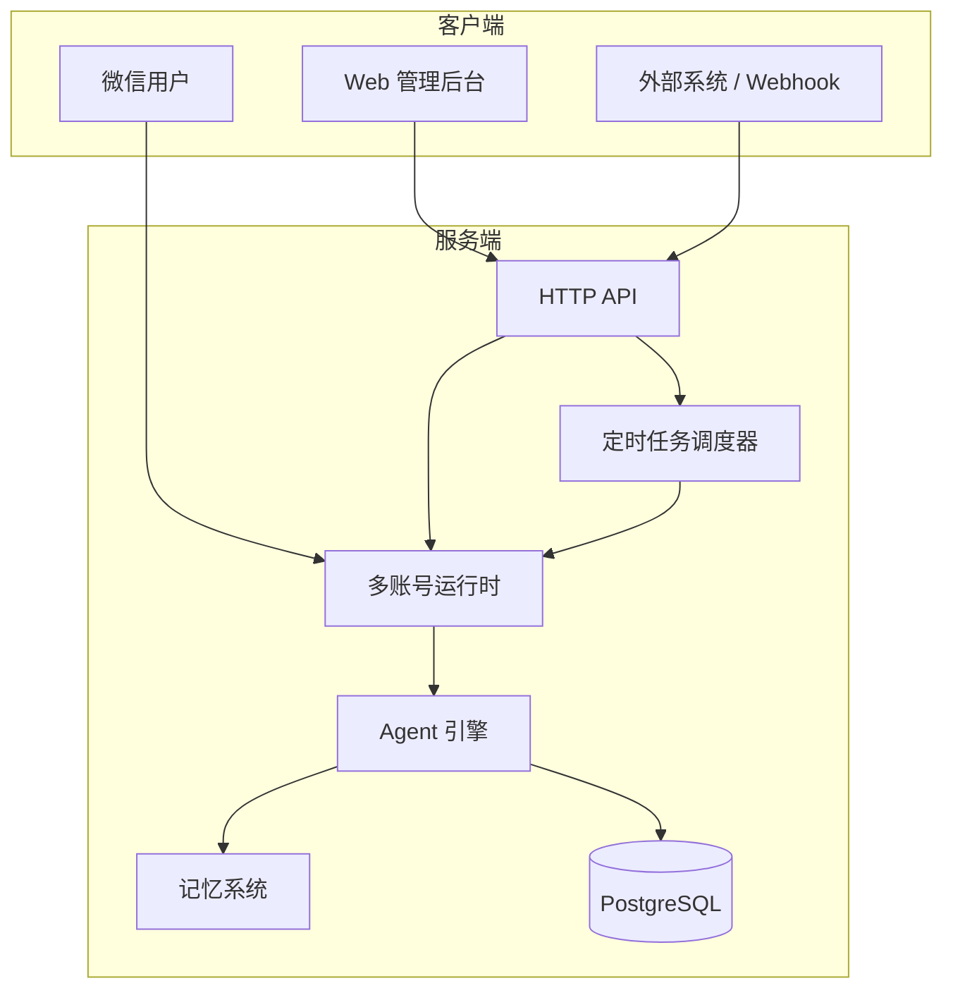

<div align="right">
  <span>[<a href="./README.md">简体中文</a>]</span>
</div>

<div align="center">
  <h1>微信 ClawBot Agent</h1>
  <p>多账号微信 AI Agent 管理平台 —— 让微信号成为你的智能助手</p>
  <div align="center">
    
    
    
    
  </div>
  <hr>
</div>

微信 ClawBot Agent 是一个多账号微信 AI 连接器。通过 Web 后台统一管理多个微信号的 AI 接入，支持扫码登录、对话持久化、基于 AI SDK 6 的 LLM 网关编排、工具/技能扩展、Tape 记忆系统、定时任务、Webhook、MCP Server 管理和可观测性追踪。每个微信号都是一个独立的 AI Agent，拥有独立的对话历史、记忆、工具调用能力和个性化配置。

## 界面预览

<table>
  <tr>
    <td></td>
    <td></td>
  </tr>
  <tr>
    <td align="center"><strong>账号管理</strong></td>
    <td align="center"><strong>记忆图谱</strong></td>
  </tr>
  <tr>
    <td></td>
    <td></td>
  </tr>
  <tr>
    <td align="center"><strong>工具列表</strong></td>
    <td align="center"><strong>技能列表</strong></td>
  </tr>
  <tr>
    <td></td>
    <td></td>
  </tr>
  <tr>
    <td align="center"><strong>运行监控 Trace</strong></td>
    <td align="center"><strong>定时任务</strong></td>
  </tr>
  <tr>
    <td></td>
    <td></td>
  </tr>
  <tr>
    <td align="center"><strong>Webhook</strong></td>
    <td align="center"><strong>MCP 服务</strong></td>
  </tr>
</table>

## 快速开始

### 环境要求

- Node.js >= 22
- pnpm >= 10
- PostgreSQL（推荐 Supabase）

### 安装

```bash
# 克隆项目
git clone <repository-url>
cd weixin-clawbot-agent

# 复制服务端环境配置
cp .env.example packages/server/.env
cp packages/server/config-example.yaml packages/server/config.yaml

# 补齐 packages/server/.env 中的数据库配置后再安装依赖
pnpm install
```

### 配置

编辑 `packages/server/.env`：

```bash
# LLM 配置（默认模型）
LLM_PROVIDER=deepseek
LLM_MODEL=deepseek-chat
LLM_API_KEY=your-api-key

# 数据库
DATABASE_URL=postgresql://...
DIRECT_URL=postgresql://...

# API 服务
API_PORT=8028
WEB_ORIGIN=http://localhost:5173
```

编辑 `packages/server/config.yaml`：

```yaml
auth:
  username: admin
  password: your-password
  jwtSecret: your-secret-key
  tokenExpiry: 24h
```

执行 Prisma 建表 / 同步 schema：

```bash
pnpm -F @clawbot/server prisma:push
```

> `pnpm -F @clawbot/server ...` 的工作目录是 `packages/server`，因此环境变量文件需要放在 `packages/server/.env`。
> 当前仓库里的 `packages/web/vite.config.ts` 将 `/api` 代理到 `http://localhost:8028`。如果你改了 `API_PORT`，记得同步修改这里的 proxy。
> 如果你只是先装依赖、还没准备好数据库配置，可以先执行 `pnpm install --ignore-scripts`，补齐 `packages/server/.env` 后再运行 `pnpm -F @clawbot/server prisma:generate`。

### LLM Provider 说明

当前版本默认采用 **AI SDK 官方 provider 包优先** 的策略：

| Provider | 接入方式 |
|------|------|
| `openai` | `@ai-sdk/openai` |
| `anthropic` | `@ai-sdk/anthropic` |
| `google` | `@ai-sdk/google` |
| `deepseek` | `@ai-sdk/deepseek` |
| `moonshot` / `kimi` / `kimi-coding` | `@ai-sdk/moonshotai` |
| `xai` | `@ai-sdk/xai` |
| `groq` | `@ai-sdk/groq` |
| `mistral` | `@ai-sdk/mistral` |
| `openrouter` | `@ai-sdk/openai-compatible` |
| 自定义 `baseUrl` | `@ai-sdk/openai-compatible` |

环境变量支持两种方式：

- 统一使用 `LLM_API_KEY`
- 或使用 provider 对应标准变量名：`OPENAI_API_KEY`、`ANTHROPIC_API_KEY`、`GOOGLE_API_KEY`、`DEEPSEEK_API_KEY`、`MOONSHOT_API_KEY`、`XAI_API_KEY`、`GROQ_API_KEY`、`MISTRAL_API_KEY`

常见配置示例：

```bash
# DeepSeek
LLM_PROVIDER=deepseek
LLM_MODEL=deepseek-chat
DEEPSEEK_API_KEY=your-api-key

# Anthropic
LLM_PROVIDER=anthropic
LLM_MODEL=claude-sonnet-4-20250514
ANTHROPIC_API_KEY=your-api-key

# Moonshot / Kimi
LLM_PROVIDER=moonshot
LLM_MODEL=kimi-k2.5
MOONSHOT_API_KEY=your-api-key
```

### 启动

```bash
# 开发模式（同时启动所有服务）
pnpm dev

# 或分别启动
pnpm dev:server   # API 服务 + 机器人运行时（localhost:8028）
pnpm dev:web      # Web 后台（localhost:5173）
```

启动后访问 http://localhost:5173/auth/login 登录管理后台。

### 生产部署

```bash
pnpm build
pnpm start   # 仅启动 Hono API + 微信运行时
```

`packages/web/dist` 需要单独部署到静态站点或反向代理后提供访问；服务端本身不会托管前端静态文件。

## 核心特性

### 多账号管理

- **扫码登录**：Web 后台一键触发微信扫码登录，二维码实时渲染
- **账号生命周期**：每个微信号对应独立 Agent 实例，支持 active/deprecated 状态管理
- **自动接管**：重复登录时旧账号自动标记，新账号无缝接管
- **账号别名**：为微信号设置别名，方便管理识别

### AI Agent 能力

- **LLM 网关编排**：基于 AI SDK 6，支持按全局 / 账号 / 对话三级解析模型配置
- **多 LLM 供应商**：支持 OpenAI、Anthropic、Google、DeepSeek、Moonshot/Kimi、xAI、Groq、Mistral；OpenRouter 与自定义兼容端点走 OpenAI-compatible 适配层
- **工具调用**：内置 `opencli`，支持 Markdown 定义的自定义 Tool，MCP Tool 独立管理，并通过 AI SDK Tool 调用链统一编排
- **技能系统**：内置 `healthy-meal-reminder`，支持 always/on-demand 两种激活模式
- **对话持久化**：消息异步写入 PostgreSQL，支持历史记录查询；历史消息采用“读旧写新”兼容策略，迁移后仍可读取旧 payload

### 记忆系统

- **双层记忆**：全局记忆（跨会话持久）+ 会话记忆（当前上下文）
- **自动压缩**：记忆条目超过阈值自动整理，保持高效检索
- **会话继承**：切换会话时高置信度记忆自动携带
- **结构化存储**：支持事实、偏好、决策等多种记忆类型

### 定时任务

- **Cron 表达式**：支持标准 Cron 语法定义执行周期
- **多账号调度**：可为每个账号配置独立的定时任务
- **执行记录**：每次执行结果持久化，支持查看历史
- **灵活启停**：随时启用或禁用任务，无需重启服务

### Webhook 集成

- **Token 认证**：基于 Token 的权限控制，支持多账号授权
- **消息投递**：外部系统可通过 Webhook 向微信对话发送消息
- **调用日志**：完整的投递记录，支持查询和排查
- **Token 轮换**：支持安全轮换 Token，不影响业务

### MCP 与可观测性

- **MCP Server 管理**：支持在 Web 后台新增、编辑、启停 stdio MCP Server
- **MCP Tool 控制**：发现的 MCP Tool 可单独启用 / 禁用，并会在消息恢复与模型转换时做参数归一化
- **Trace 追踪**：查看消息链路、LLM 轮次、Tool 调用、耗时和错误明细
- **Metrics 导出**：暴露 `/api/metrics` 文本指标，方便接 Prometheus 或自定义采集

### 管理后台

- **多账号视图**：所有微信号卡片展示，实时状态监控
- **对话管理**：查看任意账号的完整对话历史
- **可观测性**：Trace 总览、详情下钻、异常筛选
- **MCP 管理**：MCP Server / Tool 配置和状态查看
- **模型配置**：可视化配置多层级模型（全局/账号/对话）
- **定时任务**：管理 Cron 任务，查看执行记录
- **Webhook 管理**：Token 创建、授权、轮换、日志查询
- **工具/技能**：可视化启用/禁用、查看源码；安装、更新、删除能力由后端 API 提供

## 架构概览



### 项目结构

```
packages/
├── agent/              # Agent 引擎（AI SDK 编排、工具、技能、Tape 记忆、定时任务）
├── observability/      # Trace / span / metrics / 采样能力
├── server/             # 服务端（API、多账号管理、Webhook、MCP、持久化）
├── shared/             # 共享类型定义
├── web/                # React + Vite 管理后台
├── weixin-agent-sdk/   # 微信接入 SDK
└── weixin-acp/         # ACP 适配器与 CLI
```

### 数据与扩展目录

```
data/
├── skills/builtin/   # 内置技能
├── skills/user/      # 用户技能
├── tools/builtin/    # 内置工具（当前内置 opencli）
├── tools/user/       # 用户工具
└── state.json        # 工具/技能安装状态快照
```

## 核心概念

| 概念 | 说明 |
|------|------|
| **Tool** | 可调用的函数工具，如 `opencli`、用户自定义 Tool、MCP Tool |
| **Skill** | 领域知识文档，注入系统提示词增强 AI 能力 |
| **Agent** | 单个微信号的 AI 实例，拥有独立状态、记忆和配置 |
| **Memory** | 结构化记忆系统，记录事实、偏好和决策 |
| **Scheduled Task** | 定时执行的自动化任务，基于 Cron 表达式 |
| **Webhook** | 外部系统向微信账号发送消息的接口 |
| **Model Provider Template** | provider + model 列表 + baseUrl + key 的复用模板，用于生成多层级模型配置 |

## 主要页面与接口

### 管理后台页面

| 路径 | 说明 |
|------|------|
| `/auth/login` | 管理后台登录页 |
| `/` | 账号总览 |
| `/accounts/:accountId` | 对话与消息查看 |
| `/login` | 微信扫码接入 |
| `/tools` | Tool 管理 |
| `/skills` | Skill 管理 |
| `/mcp` | MCP Server / Tool 管理 |
| `/observability` | Trace 总览 |
| `/webhooks` | Webhook Token 与日志 |
| `/scheduled-tasks` | 定时任务与执行记录 |
| `/model-config` | 全局 / 账号 / 对话模型配置 |

### 主要 API

默认情况下，`POST /api/auth/login` 无需 JWT；其余 `/api/*` 接口在启用 `config.yaml` 认证后需要 `Authorization: Bearer <JWT>`。`POST /api/webhooks` 使用独立的 Webhook Token 认证。

| 方法 | 路径 | 说明 |
|------|------|------|
| POST | `/api/auth/login` | 后台账号密码登录 |
| GET | `/api/health` | 服务健康状态、运行中账号、队列长度 |
| GET/PATCH | `/api/accounts` / `/api/accounts/:accountId` | 账号列表与别名更新 |
| GET | `/api/accounts/:accountId/conversations` | 对话列表 |
| GET | `/api/accounts/:accountId/conversations/:conversationId/messages` | 消息分页 |
| POST/GET/POST | `/api/login/start` / `/api/login/status` / `/api/login/cancel` | 微信扫码登录流程 |
| GET/POST/PUT/DELETE | `/api/tools*` / `/api/skills*` | Tool / Skill 安装与启停 |
| GET/POST/PATCH/DELETE | `/api/mcp/servers*` | MCP Server 管理 |
| GET/POST | `/api/mcp/tools*` | MCP Tool 列表与启停 |
| GET/POST/PATCH/DELETE | `/api/model-provider-templates*` | Provider 模板管理 |
| GET | `/api/observability/overview` / `/api/observability/traces/:traceId` | Trace 统计与详情 |
| GET | `/api/metrics` | 文本指标导出 |
| POST/GET/PATCH/DELETE | `/api/webhooks*` | Webhook 投递、Token 管理、日志 |
| GET/PATCH | `/api/scheduled-tasks*` | 定时任务列表、启停、运行记录 |
| GET/PUT/DELETE | `/api/model-configs*` | 多层级模型配置 |

## 技术栈

- **前端**：React 19 + React Router 7 + Vite 8 + Tailwind CSS 4
- **后端**：Node.js + Hono + Prisma + PostgreSQL
- **Agent 内核**：`@clawbot/agent` + `ai` / AI SDK 6
- **模型 Provider**：`@ai-sdk/openai`、`@ai-sdk/anthropic`、`@ai-sdk/google`、`@ai-sdk/deepseek`、`@ai-sdk/moonshotai`、`@ai-sdk/xai`、`@ai-sdk/groq`、`@ai-sdk/mistral`、`@ai-sdk/openai-compatible`
- **可观测性**：`@clawbot/observability`
- **微信接入**：`@clawbot/weixin-agent-sdk` / `weixin-acp`

## 路线图

- [x] 多 LLM 供应商支持
- [x] 记忆系统（全局/会话双层记忆）
- [x] 定时任务（Cron 调度）
- [x] Webhook 集成（Token 认证、消息投递）
- [x] MCP Server / Tool 管理
- [x] Observability Trace 与 Metrics
- [ ] 浏览器自动化
- [ ] 更多内置技能和工具

## License

GPL-3.0
