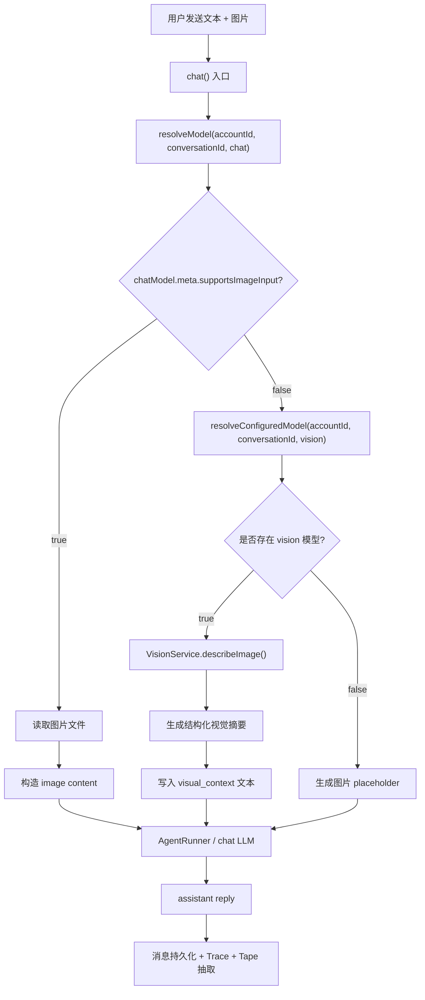

# Vision 模型兜底设计

## 背景

当前微信 Agent 会收到图片消息，但并非所有 chat 模型都支持视觉输入。例如用户把 chat 模型配置为 DeepSeekV4Flash 时，模型本身无法直接理解 image block。

本设计目标是：**在不改变主 chat 模型的前提下，为不支持视觉的模型补上图片理解能力**。

工程命名统一使用 `vision`。
## 核心决策

Vision 不是默认暴露给 Agent 自主选择的工具，而是 **模型能力补全层**。

处理图片时，系统先判断当前 chat 模型是否支持视觉：

1. chat 模型支持视觉输入  
   直接把图片作为 image content 传给 chat LLM。

2. chat 模型不支持视觉输入，但配置了 vision 模型  
   先调用 vision 模型生成结构化图片理解结果，再把结果作为文本上下文交给 chat LLM。

3. chat 模型不支持视觉输入，也没有配置 vision 模型  
   维持现有兜底行为，使用 `[图片已省略]` 或类似 placeholder 文本。

## 总体流程



## 模型配置

现有模型配置已经有 `purpose` 概念，例如：

- `chat`
- `extraction`

建议新增：

- `vision`

含义：

| purpose | 作用 |
| --- | --- |
| `chat` | 主对话模型，负责最终回复、工具调用和推理 |
| `extraction` | 记忆抽取模型 |
| `vision` | 图片理解模型，仅在 chat 模型不支持视觉时调用 |

配置解析仍然遵循项目现有规则：

```text
conversation config → account config → global config
```

也就是说，可以为某个账号单独配置更强的 vision 模型，也可以设置一个全局默认 vision 模型。

## 推荐运行时判断

在 `chat.ts` 处理图片时增加分支：

```text
if media.type === "image":
  if chatModel.meta.supportsImageInput === true:
    append image block
  else:
    visionModel = resolveConfiguredModel(accountId, conversationId, "vision")
    if visionModel:
      visualSummary = describeImageWithVisionModel(visionModel, media.filePath, userText)
      append text block with <visual_context>
    else:
      append text block with image placeholder
```

注意：

- 只有 `supportsImageInput === true` 时，才把图片直接交给 chat 模型。
- `supportsImageInput === false` 或未声明时，都按“不确定是否支持视觉”处理，进入 vision fallback 或 placeholder。
- vision fallback 不应该改变主 chat 模型，chat LLM 仍然是最终回答者。

## 如何判断 chat 模型是否支持 Vision

当前项目已有 `ModelMeta.supportsImageInput` 字段：

```typescript
export interface ModelMeta {
  contextWindow: number;
  maxOutputTokens: number;
  /**
   * true means the model can receive image content directly.
   * false or undefined means image content must not be sent directly.
   */
  supportsImageInput?: boolean;
}
```

运行时判断应只依赖 resolved chat model 的 metadata：

```typescript
const chatModel = await resolveModel(accountId, conversationId, "chat");
const chatSupportsVision = chatModel.meta.supportsImageInput === true;
```

建议封装 helper，避免各处重复写三态判断：

```typescript
function modelSupportsVision(meta: ModelMeta): boolean {
  return meta.supportsImageInput === true;
}
```

判断规则：

| `supportsImageInput` | 处理方式 |
| --- | --- |
| `true` | chat 模型支持视觉，直接传 image block |
| `false` | chat 模型不支持视觉，尝试 vision fallback |
| `undefined` | 能力未知，保守处理为不支持，尝试 vision fallback |

不要使用“provider 级别”直接判断视觉能力，因为同一个 provider 下可能同时存在视觉模型和纯文本模型。

例如：

- OpenAI 下面有支持视觉的模型，也可能配置纯文本模型。
- Google Gemini 系列通常支持视觉，但仍应以具体 model metadata 为准。
- OpenRouter 代理的模型能力差异更大，更不能只按 provider 判断。

### 模型能力表

建议在 provider factory 中增加模型级能力表，并与 provider 默认 metadata 合并。

示例：

```typescript
const MODEL_CAPABILITIES: Record<string, Partial<ModelMeta>> = {
  "deepseek:deepseek-chat": { supportsImageInput: false },
  "deepseek:deepseek-reasoner": { supportsImageInput: false },

  "openai:gpt-4.1": { supportsImageInput: true },
  "openai:gpt-4.1-mini": { supportsImageInput: true },
  "openai:gpt-4o-mini": { supportsImageInput: true },

  "google:gemini-2.5-flash": { supportsImageInput: true },
  "google:gemini-2.5-flash-lite": { supportsImageInput: true },

  "anthropic:claude-3-5-haiku-latest": { supportsImageInput: true },
};
```

构造模型时合并：

```typescript
const providerMeta = PROVIDER_DEFAULTS[provider] ?? FALLBACK_META;
const modelMeta = MODEL_CAPABILITIES[`${provider}:${modelId}`] ?? {};

const meta: ModelMeta = {
  ...providerMeta,
  ...modelMeta,
};
```

### 后台手动覆盖

静态能力表不可能覆盖所有 OpenAI-compatible provider、自定义 base URL 和第三方代理模型。因此后台应允许用户手动覆盖模型能力。

推荐增加一个模型能力配置项：

```text
支持视觉输入：是 / 否 / 跟随系统默认
```

解析优先级：

```text
用户手动覆盖 > MODEL_CAPABILITIES > PROVIDER_DEFAULTS > FALLBACK_META
```

后台展示建议：

```text
当前 Chat 模型：deepseek-v4-flash
视觉输入：不支持
Vision 兜底模型：已配置 / 未配置
最终图片处理方式：Vision fallback / Placeholder
```

不需要额外提供“测试图片输入”按钮。V1 以静态能力表和用户手动覆盖为准。

## Vision Prompt 设计

Vision 模型的职责是生成图片理解上下文，不负责最终回复用户。

输入包括：

| 输入 | 说明 |
| --- | --- |
| `image` | 当前图片内容 |
| `userText` | 用户随图发送的文字，用于辅助判断图片意图 |
| `recentContext` | 可选，最近少量对话上下文，仅用于理解指代，不用于长期推理 |

V1 建议把 `recentContext` 控制在最近 2 到 4 条用户/助手文本消息内，且不包含旧图片 base64，避免 vision 调用变成第二个 chat pipeline。

推荐 system prompt：

```text
你是一个图片理解模块，不是对话助手。
你的任务是把图片内容转换成结构化上下文，供另一个不支持视觉输入的文本模型继续推理。

要求：
1. 只描述图片中可见或可合理 OCR 得到的信息。
2. 不要替用户完成最终回答。
3. 如果用户文字中包含问题，只把它作为理解图片重点的线索。
4. 不要编造图片中没有的信息。
5. 输出一个 JSON 对象，不要输出 Markdown 或额外解释。

JSON 格式：
{
  "summary": "一句话图片摘要",
  "ocr_text": ["图片中识别出的文字，按阅读顺序排列"],
  "objects": ["关键对象或界面元素"],
  "scene": "图片场景类型",
  "possible_intent": "结合用户文字推测的上传意图；无法判断则写 unknown",
  "confidence": 0.0,
  "limitations": ["识别限制或不确定点"]
}
```

调用策略：

- 优先使用 provider 支持的 JSON mode / structured output。
- 如果 provider 不支持 structured output，则使用 prompt 约束 + JSON 提取解析。
- 如果解析失败，尝试从文本中提取第一个 JSON object。
- 如果仍失败，降级为普通文本摘要并包装成 `VisualContext.summary`，同时记录 `fallbackReason = "vision_parse_failed"`。

## Vision 输出格式

Vision 模型不要只返回一句 caption，建议返回结构化结果，方便 chat LLM 稳定消费。

推荐内部结构：

```json
{
  "summary": "这是一张微信聊天截图，展示了用户在讨论 Agent 记忆系统。",
  "ocr_text": [
    "查看现有的记忆系统的实现",
    "画出一个架构草图"
  ],
  "objects": ["聊天界面", "中文文本", "代码片段"],
  "scene": "技术讨论截图",
  "possible_intent": "用户希望基于截图继续讨论系统设计",
  "confidence": 0.91,
  "limitations": ["无法确认截图外上下文", "小字号文本可能识别不完整"]
}
```

注入给 chat 模型时建议转换为稳定文本：

```text
<visual_context>
用户上传了一张图片。当前 chat 模型不支持视觉输入，以下内容由 vision 模型生成。

图片摘要：
这是一张微信聊天截图，展示了用户在讨论 Agent 记忆系统。

OCR 文字：
- 查看现有的记忆系统的实现
- 画出一个架构草图

关键对象：
- 聊天界面
- 中文文本
- 代码片段

场景判断：
技术讨论截图

可能意图：
用户希望基于截图继续讨论系统设计

置信度：
0.91

限制：
- 无法确认截图外上下文
- 小字号文本可能识别不完整
</visual_context>
```

## 多图场景

微信侧可能出现连续多张图片，或一条消息中附带多张图片。V1 按以下规则处理：

1. 每张图片独立生成一个 `VisualContext`。
2. vision 调用可以并行执行，但需要设置并发上限，建议同一消息最多并发 2 个。
3. 每张图片的摘要有长度上限，避免多图把 chat prompt 挤爆。
4. 注入给 chat LLM 时保留图片编号。

多图注入格式：

```text
<visual_context image_index="1">
图片摘要：...
OCR 文字：...
限制：...
</visual_context>

<visual_context image_index="2">
图片摘要：...
OCR 文字：...
限制：...
</visual_context>
```

推荐默认限制：

| 限制项 | 建议值 |
| --- | --- |
| 单次消息最多处理图片数 | 4 |
| 单张图片视觉摘要上限 | 1200 汉字 |
| 多图合计视觉摘要上限 | 3000 汉字 |
| 超限策略 | 保留前 N 张，后续图片降级为 placeholder |

如果用户连续多条消息分别发图，每条消息仍按自己的 message payload 保存对应 `VisualContext`。

## 持久化建议

Vision 摘要应该随消息一起持久化，避免历史恢复时重复调用 vision 模型。

建议在 message payload 中保存：

```json
{
  "visualContext": {
    "provider": "vision",
    "modelId": "qwen-vl-plus",
    "generatedAt": "2026-05-21T00:00:00.000Z",
    "summary": "...",
    "ocrText": ["..."],
    "objects": ["..."],
    "scene": "...",
    "possibleIntent": "...",
    "confidence": 0.91,
    "limitations": ["..."]
  }
}
```

后续读取历史时：

- 如果原始图片仍可用，并且当前 chat 模型支持视觉，可以继续传 image block。
- 如果当前 chat 模型不支持视觉，但 payload 中已有 `visualContext`，优先复用已有视觉摘要。
- 如果没有 `visualContext`，再考虑调用 vision 模型或降级 placeholder。

## 原始图片生命周期

Vision fallback 不应依赖原始图片长期存在。

推荐约定：

- 原始图片由现有 media cache 保存，按缓存策略清理。
- `VisualContext` 是长期可复用的文本化图片理解结果，应随消息 payload 持久化。
- 历史恢复时，如果原始图片已删除但 `VisualContext` 仍存在，继续使用 `VisualContext`。
- 如果原始图片和 `VisualContext` 都不存在，则使用 placeholder。
- Web UI 展示历史消息时，可以标记“原图已过期，保留视觉摘要”。

这意味着：图片文件是短到中期缓存，`VisualContext` 才是长期上下文资产。

## 上下文裁剪策略

`VisualContext` 与它所属的用户消息绑定。V1 不把视觉摘要提升成全局高优先级上下文。

裁剪原则：

```text
system prompt / 当前输入 / 最近消息 > 最近消息中的 visual_context > 远期消息及其 visual_context
```

具体规则：

- 如果一条用户消息被保留，则优先保留该消息的 `VisualContext` 文本。
- 如果该消息过长，可以压缩 `VisualContext`，优先保留 `summary` 和 `ocr_text`。
- 如果整条历史消息被裁剪，则它绑定的 `VisualContext` 一起消失。
- 不单独把很久以前的 `VisualContext` 强行注入 prompt；真正值得长期记住的图片信息应由 Tape 抽取成结构化记忆。

这样可以避免“用户很久以前发过一张图，后续对话仍反复携带大段视觉摘要”的 token 膨胀问题。

## Trace 与可观测性

建议新增 span：

```text
vision.describe
```

推荐记录 attributes：

| 字段 | 说明 |
| --- | --- |
| `model` | vision 模型 ID |
| `provider` | provider 名称 |
| `imageMimeType` | 图片 MIME |
| `imageBytes` | 图片大小 |
| `latencyMs` | 视觉识别耗时 |
| `inputTokens` | 输入 token |
| `outputTokens` | 输出 token |
| `confidence` | vision 输出置信度 |
| `fallbackReason` | 为什么触发 vision fallback |

`fallbackReason` 使用枚举值，不使用自由字符串：

```typescript
type VisionFallbackReason =
  | "chat_model_no_vision"
  | "chat_model_vision_unknown"
  | "no_vision_model_configured"
  | "vision_call_failed"
  | "vision_call_timeout"
  | "vision_empty_result"
  | "vision_parse_failed"
  | "image_limit_exceeded";
```

这样可以在运行监控里区分：

- chat 模型直接看图
- vision fallback 成功
- vision fallback 失败后使用 placeholder

## 错误处理

Vision fallback 不能阻断主对话。

推荐策略：

1. vision 模型调用成功  
   注入 `<visual_context>`。

2. vision 模型调用失败、超时、限流  
   记录 warn 和 trace error，然后降级为 placeholder。

3. vision 模型返回空结果  
   降级为 placeholder，并在 placeholder 中说明图片无法识别。

兜底文本示例：

```text
[图片：当前 chat 模型不支持视觉输入，且未配置可用的 vision 模型或识别失败]
```

## 与工具式看图的关系

第一版不建议把 vision 作为默认 Agent tool 暴露。

原因：

- 微信图片消息是输入模态问题，不应该依赖 chat LLM 自己决定是否调用工具。
- 如果 chat 模型不支持视觉，它在看到图片前就无法判断图片内容。
- 自动 fallback 更符合用户预期：发图后系统自然理解。

后续可以补充一个高级工具：

```text
inspect_image(image_id, question?, detail_level?)
```

这个工具适合二次追问细节，例如“放大看图里的表格第三行是什么”。但它不是 V1 的主路径。

## 最小落地步骤

### Phase 1：模型配置与能力判断

- 在模型配置中允许 `purpose = "vision"`。
- 后台 UI 增加“Vision 识图模型”配置入口。
- model metadata 明确维护 `supportsImageInput`。
- 增加 `modelSupportsVision(meta)` helper。
- 增加模型级 `MODEL_CAPABILITIES`，并支持后台手动覆盖。

### Phase 2：端到端 Vision fallback PoC

- 新增 `VisionService` 或 `describeImageWithVisionModel()`。
- 输入：`filePath`, `mimeType`, `userText`, `modelConfig`。
- 输出：结构化 `VisualContext`。
- 增加超时、错误降级和 trace。
- 在图片处理分支判断 `chatModel.meta.supportsImageInput`。
- 支持三段式路由：chat 直看图 → vision fallback → placeholder。
- 将 vision 摘要注入为 text block。
- 先跑通单图端到端链路，再扩展多图和复用。

### Phase 3：持久化与复用

- 将 `VisualContext` 写入 message payload。
- 历史恢复时优先复用已有 `VisualContext`。
- 上下文裁剪时，保留视觉摘要文本，避免图片 base64 占用过多上下文。

### Phase 4：多图与策略加固

- 支持多图并发识别和注入编号。
- 增加视觉摘要长度上限。
- 增加 `VisionFallbackReason` 聚合指标。
- Web UI 展示原图过期但视觉摘要仍可用的状态。

## 预期效果

配置 DeepSeekV4Flash 作为 chat 模型时：

```text
chat = deepseek-v4-flash
vision = qwen-vl-plus / gemini-2.5-flash-lite / gpt-4.1-mini
```

用户发送图片后：

1. 系统检测 DeepSeekV4Flash 不支持视觉。
2. 调用 vision 模型生成视觉摘要。
3. DeepSeekV4Flash 读取视觉摘要并完成推理回复。

这样主模型仍然保持低成本、高速度，同时在图片场景下拥有可用的视觉感知能力。
