# @clawbot/agent 架构图 / Architecture

> 本文件描述 `packages/agent` 的当前编排边界。静态图由 `beautiful-mermaid` 从 [`architecture.mmd`](./architecture.mmd) 渲染生成。
>
> This document describes the current orchestration boundaries of `packages/agent`. The static diagram is rendered from [`architecture.mmd`](./architecture.mmd) with `beautiful-mermaid`.

## 关键路径 / Key Paths

- `server` 包在启动时注入 Port 实现，并通过 `setChatDeps()` 装配 `AgentRunner`。
- The `server` package injects Port implementations at startup and wires `AgentRunner` through `setChatDeps()`.
- `chat.ts` 负责一次用户会话的外层编排：加载历史和 Tape 记忆、解析模型、组装用户上下文、调用 Runner、持久化结果、触发异步记忆提取。
- `chat.ts` owns the outer conversation flow: load history and Tape memory, resolve the model, assemble user context, call the Runner, persist results, and trigger async memory extraction.
- `runner.ts` 负责 LLM tool-use 循环：每轮组装 system prompt、裁剪上下文、调用 AI SDK、并行执行 tool calls，直到返回最终文本或达到 `maxRounds`。
- `runner.ts` owns the LLM tool-use loop: assemble the system prompt, trim context, call the AI SDK, execute tool calls in parallel, and stop when final text returns or `maxRounds` is reached.
- 工具通过 `CompositeToolRegistry` 合并本地工具、MCP 工具、scheduler/heartbeat 工具等来源；`use_skill` 是 Runner 内建工具，用于把 on-demand skill 注入后续轮次的 system prompt。
- Tools are merged by `CompositeToolRegistry` from local tools, MCP tools, scheduler/heartbeat tools, and other registries. `use_skill` is a Runner built-in that injects on-demand skill instructions into later system prompts.
- `agent` 包只依赖 Port 接口，不直接依赖 Prisma、HTTP、微信协议或 `server` 包实现。
- The `agent` package depends only on Port interfaces. It does not directly depend on Prisma, HTTP, WeChat protocol code, or `server` package implementations.

## Mermaid 源 / Mermaid Source

Mermaid 源文件位于 [`architecture.mmd`](./architecture.mmd)。修改图时先更新该文件，再用 `beautiful-mermaid` 重新生成 `architecture.svg`。

The Mermaid source lives in [`architecture.mmd`](./architecture.mmd). Update that file first, then regenerate `architecture.svg` with `beautiful-mermaid`.
