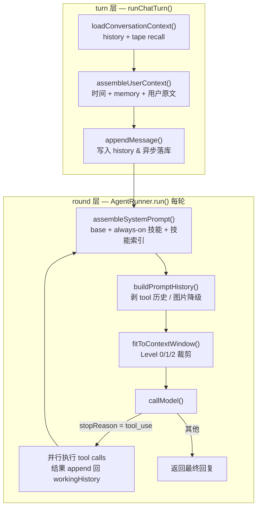

# Context 组装与裁剪架构

> 描述 `packages/agent` 中"一次 LLM 调用的 context 如何组装、超出模型窗口时如何降级"的当前实现。
>
> 设计背景与取舍见 [docs/2026-04-08_15_29_context-window-management.md](../../../docs/2026-04-08_15_29_context-window-management.md)；本文件描述**代码现状**，两者不一致时以本文件为准。

## 一、总览

Context 的组装分两层：

- **turn 层**（`src/engine/turn.ts`）：一次用户输入 = 加载历史 + 召回 Tape 记忆 → 拼出本轮 user message → 交给 Runner → 持久化 → 异步提取记忆。每 turn 执行一次。
- **round 层**（`src/engine/runner.ts`）：LLM tool-use 循环的每一轮 = 重新 assemble system prompt → 按模型能力预处理历史 → 裁剪到预算内 → 调模型。每轮执行一次，工具调用中途也会重新裁剪。



## 二、Context 的四个组成部分

| 部分 | 来源 | 重算频率 |
|---|---|---|
| system prompt | `assembleSystemPrompt()` — 基础 prompt + always-on 技能正文 + on-demand 技能索引行 | **每轮**（`use_skill` 可能上一轮才加载新技能） |
| tools schema | `tools.current().tools` + `USE_SKILL_TOOL`，序列化为 JSON | run 开始时一次，token 数缓存复用 |
| history | `ConversationCache` 中的会话消息数组 | 每轮追加 assistant / toolResult |
| 本轮 user message | `assembleUserContext()` — `[当前时间]` + `<memory>` + 用户原文（+ 图片） | 每 turn 一次 |

关键位置：

- `src/engine/system-prompt.ts:11` — `assembleSystemPrompt()`
- `src/prompts/assembler.ts:90` — `assembleUserContext()`
- `src/prompts/profiles.ts:15` — `PROMPT_PROFILES.chat` 声明该 lane 允许注入哪些 context（`injectSkills` / `injectTapeMemory` / `injectTime`）
- `src/engine/runner.ts:439-456` — tools schema 序列化与固定开销估算

### 为什么记忆放在 user message 而不是 system prompt

Tape 记忆由 `formatMemoryForPrompt()` 渲染成 `<memory>` 块，拼在**本轮 user message 前部**（`src/engine/turn.ts:143`），而不是进 system prompt。这样记忆随对话轮次自然滚动，也让 system prompt 在一次 run 内只随技能变化——两者的失效周期不同，混在一起会互相污染。

## 三、Token 预算

```
budget = meta.contextWindow − meta.maxOutputTokens − (systemPrompt tokens + toolsSchema tokens)
```

`src/engine/conversation/context-window.ts:168`。三项含义：

- `contextWindow` / `maxOutputTokens` 由 `resolveModelMeta()`（`src/llm/model-meta.ts`）按**模型**解析，数据来自 `src/llm/data/` 下由 models.dev 生成的目录。查表顺序：精确 id → 归一化 id（剥日期后缀 / `-latest` / `:free` 变体）→ `FALLBACK_MODEL_META`（128k / 4096），最后叠加 `model-overrides.ts` 的人工补丁。
- `maxOutputTokens` **不会发给 provider**，它唯一的用途就是在这里当输出预留。上游常用 `output === context` 表示"输出不单独设限"，生成时会把预留收敛到「不超过模型能输出的量、不超过 32k、不超过窗口一半」三者最小值——否则预算直接为负，裁剪器会读成"全部丢弃"。
- 固定开销 = system prompt + tools schema，由 Runner 估算后传入，裁剪函数本身不感知它们的内容。

元数据是**每模型**而非每 provider 的：同一家的窗口能从 8k（小米的 TTS 模型）跨到 1M（mimo-v2.5），provider 平均值对它覆盖的绝大多数模型都是错的，而且错得不对称——猜大了是 provider 400，猜小了是静默过度裁剪。

### Token 计数是启发式，不是 tokenizer

`src/llm/token-estimator.ts` 不引入任何 tokenizer 依赖：

- 文本：`length / 3`（中英混排的保守中间值）
- 图片：base64 长度 × 0.75 → 字节 / 3（按上界估，宁可高估）
- 每条消息 +4 固定开销（role、分隔符）
- 预算判断时统一乘 1.1 安全边际（`withSafetyMargin()`）

精度够做预算决策，**不可用于计费**。真实 token 用量走 `message.usage`，由 `UsageStore` 单独记录。

## 四、裁剪前的预处理

`buildPromptHistory()`（`src/engine/runner.ts:247`）在裁剪前按模型能力改写历史，两步都返回副本：

1. `requiresReasonedToolHistory` 的模型（DeepSeek thinking 系）→ `narrateUnreasonedToolCalls()` 把缺少 reasoning 的 tool 往返压成叙述文本。
2. 不支持视觉的模型 → `replaceImagesWithTextPlaceholders()` 把图片换成文本占位。

注意这一步的图片替换是**能力适配**（模型根本读不了图），与下面 Level 1 的**预算裁剪**（模型能读但装不下）是两件事。

### 为什么是叙述化而不是删除

DeepSeek thinking 模式拒收"有 tool call 但没有 reasoning_content"的历史 assistant 消息。历史会变成这个形状，主要不是遗留数据，而是**切换会话模型的常规后果**：会话先跑在非思考模型上产生了工具调用，之后切到 thinking 模型，整段历史重放时就命中了。

早期实现是直接删掉 tool call 和对应的 toolResult，有两个问题：模型丢失了"这个工具已经调过、返回了什么"的记录；更糟的是当 assistant 消息形如"我查一下" + tool call 时，删除只留下那句话而抹掉结果，模型的合理反应是**重新调一次**，新记录下一轮又被删——一路撞到 `maxRounds` 才停。

现在改为把整个往返改写成 `[已调用工具 web_search({...})，返回：...]` 的文本块，留在原 assistant 消息里。信息得以保留，纯文本被所有 provider 接受（不需要伪造 reasoning，也不依赖任何 provider 的私有 wire format），上述循环随之消失。工具输出超过 2000 字符会截断。

历史在数据库里**保持 provider-neutral**，叙述化只发生在发送边界——同一段历史今天发给 DeepSeek 要压平、明天切回别的模型要保持结构化，一旦落库就还原不回来了。

## 五、超出预算时：三级递进裁剪

入口 `fitToContextWindow()`（`src/engine/conversation/context-window.ts:164`），纯函数，返回新数组，**不修改 `workingHistory`，更不影响数据库**——裁剪只作用于这一次发给模型的副本。

### Level 0 — 无需裁剪

`withSafetyMargin(originalTokens) <= budget`，原样返回。

### Level 1 — 图片降级

`recentBoundary` 之前的老消息，图片块替换为 `[图片: 已省略]`。`recentBoundary` 由 `findRecentTurnsBoundary()` 从尾部倒数 `minRecentTurns`（默认 2）个 user 轮次确定，**最近窗口内的消息永不降级**。

### Level 2 — 滑动窗口

在 Level 1 结果之上（不丢弃 Level 1 已省下的 token）：

1. 逐条累加每条消息的 token，从头丢弃直到补齐超额量。
2. `findSafeCutIndex()` 把切点吸附到安全边界：
   - 不能切断 assistant 的 `tool_call` 与其后续 `toolResult` 的配对；
   - 首条保留消息必须是 `user` 或 `trigger` 角色（API 要求）。`trigger` 同样合格——它以 user 消息抵达模型，丢掉它会让它引发的那条 assistant 回复变得无从解释。
3. 开头插入一条 `[以上 N 条早期对话已省略]` 的 user 消息。

### 边界情况：一条都丢不掉

当所有消息都落在受保护的最近窗口内（典型场景：会话第一轮就是超大输入），`droppedCount === 0`，此时**放弃裁剪并返回 Level 1 结果**，仍标记 `trimLevel: 2`（`context-window.ts:238`）。

理由写在代码注释里：插入省略提示会注入一条用户从未说过的消息，且让 payload 比它本该缩小的历史更大。这里保护窗口的优先级高于预算，调用方从 `trimmedTokens` 能观察到实际超预算。

### Level 3（摘要压缩）尚未实现

设计文档把它列为后期可选项。当前最激进的手段就是丢弃早期消息，语义连续性由 Tape 记忆兜底，而非对话摘要。

## 六、旁路的其他限流

裁剪不是唯一的 context 控制手段，以下几处各自独立生效：

| 机制 | 阈值 | 位置 |
|---|---|---|
| 记忆注入预算 | 1000 tokens，按 偏好 → 事实 → 决策 优先级取用 | `src/memory/service.ts:224` |
| 注入的近期决策条数 | 5 | `PROMPT_DECISION_LIMIT` |
| Tape 压缩触发 | 增量 entry ≥ 200 折叠为 checkpoint 快照 | `compactIfNeeded()` |
| checkpoint 快照决策上限 | 50 | `CHECKPOINT_DECISION_LIMIT` |
| `/reset` handoff 携带决策 | 20 | `HANDOFF_DECISION_LIMIT` |
| tool-use 循环轮数 | `maxRounds` 默认 10，超出返回 `max_rounds` 并降级回复 | `src/engine/runner.ts:423` |
| 会话历史内存缓存 | 500 个会话，LRU 淘汰 | `src/engine/conversation/cache.ts:45` |

记忆预算被打满时会追加一句"（记忆超出预算，已省略 N 条较早内容）"——不加这句，模型会把"没提到"读成"不存在"，然后带着错误的自信作答。

Tape 压缩时 facts / preferences 故意**不**截断：它们的源 entry 会被标记 compacted 并最终清理，从快照里丢掉等于永久删除。decisions 是 append-only 的时间线事件，截断只损失久远历史，可以接受。

## 七、可观测性

每轮裁剪都上报（`recordTrimMetrics()`，`src/engine/runner.ts:259`）：

- `contextTrimTotal{trim_level}` — 各级裁剪触发次数
- `contextTokensOriginal` / `contextTokensTrimmed` — 裁剪前后 token 分布
- `contextMessagesDropped` — 丢弃消息条数
- `trimLevel > 0` 时额外打一行 `[context-window]` 日志

排查"模型好像忘了前面说的话"时，先看 `contextTrimTotal{trim_level="2"}` 是否在涨。

## 八、已知短板

1. **历史从数据库全量加载**。`restoreHistory()`（`packages/server/src/db/messages.ts:381`）没有 `limit`，长会话冷启动会把全部消息拉进内存并 hydrate。裁剪只发生在"发给模型"这一层，正确性没问题，但加载耗时与内存占用随会话长度线性增长。
2. **DB 配置无法覆盖窗口大小**。模型元数据已经是每模型粒度，但 DB 里的模型配置仍只能覆盖 `supportsImageInput`（`buildModelFromConfig()` 的 `supportsImageInputOverride`）。接自定义中转站或私有部署时，若模型不在生成目录里，只能落到 `FALLBACK_MODEL_META`，或改 `model-overrides.ts` 重新发版——用户无法在后台自助修正。补齐需要动 Prisma schema、server API 和 Web 表单。
3. **生成目录会过期**。models.dev 新增模型不会自动同步，需要人工跑 `generate:models`。`check:models` 只校验产物完整性，不校验新鲜度——把新鲜度纳入 CI 会让上游一发新模型就红，那不是本仓的缺陷。
4. **Token 估算与真实值存在偏差**。10% 安全边际覆盖常规情况，但纯 CJK 长文本或大量结构化 JSON 的 tool result 可能偏离更多。
5. **Level 3 摘要压缩缺位**，早期上下文一旦滑出窗口就只剩 Tape 记忆里的结构化片段。
